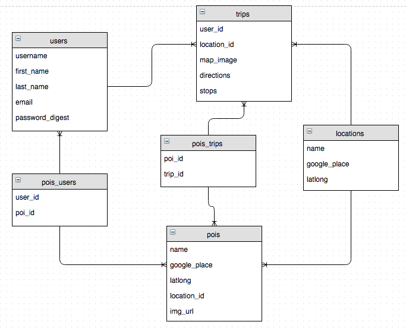
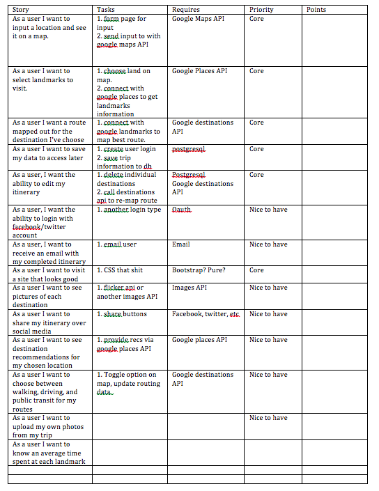
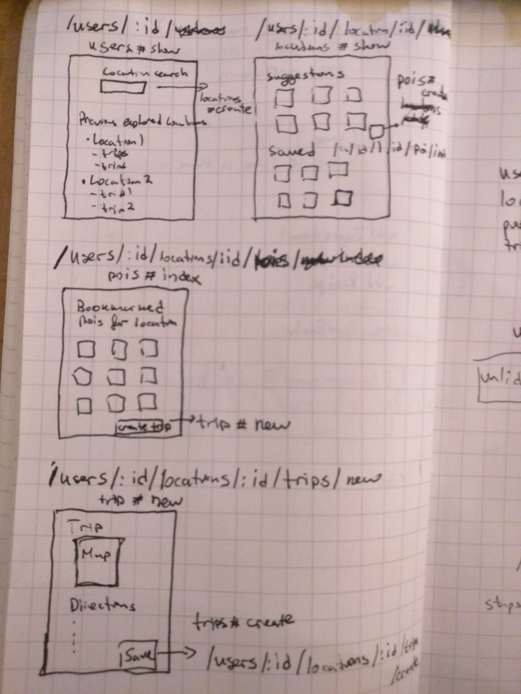

# Trippy

WDI Project 3, name pending

<h1>Trippy, or Tripper, or Tripoholic, or whatevs... you decide</h1>

Contributors: James Leisy, Johnathan Chei, David Vinkesteijn, Peter Petrov
Advisors: Andrew Fritz, Sung Choi

<h2>Summary</h2>
This project was created with the traveler in mind. When traveling to a new destination, it can be cumbersome to jump between mutiple sites just to find interesting points of interest at any destination. Our app solves this problem, by allowing a user to easily search a location and get a list of spots to checkout in that area. The user can then bookmark any of these options and create a trip, or save them for later. Once a trip is created, the user will get step by step directions to each of the choosen places.  

<h3>ERD</h3>

<h3>BRD</h3>

<h3>Wireframe</h3>

<h3>Database Design</h3>

<h3>Routes</h3>

# 
Taken from http://stackoverflow.com/questions/5267998/rails-3-field-with-errors-wrapper-changes-the-page-appearance-how-to-avoid-t

by Adrien Macniel

config.action_view.field_error_proc = Proc.new { |html_tag, instance| 
html_tag
}

Appears in config/application.rb lines 34 - 36
